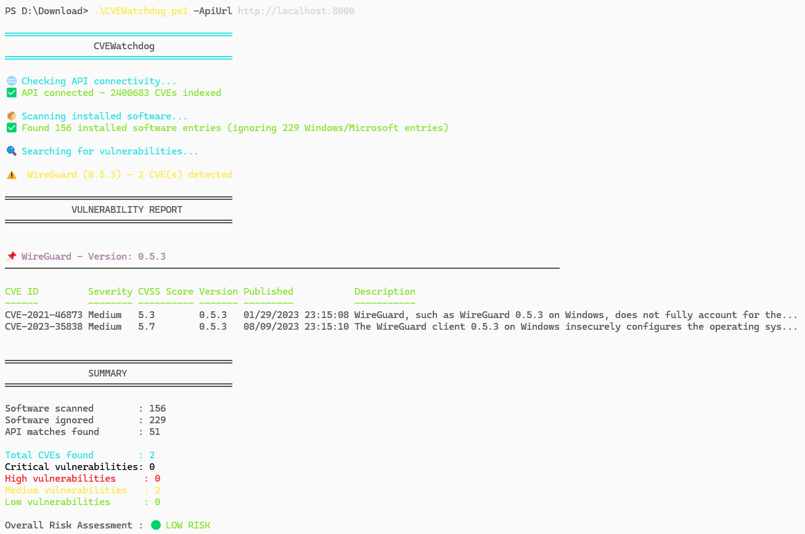

# CVEWatchdog 🔍

**CVEWatchdog** is a cross-platform vulnerability scanner client for [FastCVE-API](https://github.com/CobblePot59/FastCVE-API) that identifies CVEs (Common Vulnerabilities and Exposures) on installed software.

## 🚀 Features

- **Automated scanning** of installed software
- **Intelligent name matching** with product name variations
- **Detailed CVE reports** with CVSS scores and severity levels
- **Severity filtering** (Critical, High, Medium, Low)
- **Comprehensive summary** with overall risk assessment

## 📋 Requirements

### Windows

- **PowerShell 5.0+** (Windows 10/11 or Server 2016+)
- **FastCVE-API** service running locally or accessible on your network
- Administrator access to read Windows Registry

### Linux

- ⏳ TODO - Implementation planned

## 🛠️ Installation

### Windows

```bash
# Clone the repository
git clone https://github.com/CobblePot59/CVEWatchdog.git
cd CVEWatchdog

# Set execution policy to allow script execution
Set-ExecutionPolicy -ExecutionPolicy RemoteSigned -Scope CurrentUser
```

### Linux

- ⏳ TODO - Implementation planned

## 🎯 Usage

### Windows

Basic usage:
```powershell
.\CVEWatchdog.ps1 -ApiUrl http://localhost:8000
```

Advanced options:
```powershell
# Include wildcard CVEs (version = *)
.\CVEWatchdog.ps1  -ApiUrl http://localhost:8000 -Wildcards

# Enable debug mode to see name variations being tested
.\CVEWatchdog.ps1  -ApiUrl http://localhost:8000 -DebugMatching

# Specify custom API URL
.\CVEWatchdog.ps1 -ApiUrl "http://192.168.1.100:8080"
```

### Linux

- ⏳ TODO - Implementation planned

## 📊 Output

The script generates a structured report with:

- **Vulnerable software list** with detailed CVE information
- **CVE table** containing:
  - CVE ID
  - Severity level (Critical/High/Medium/Low)
  - CVSS Score
  - Affected version
  - Publication date
  - Description

- **Summary** with:
  - Total CVEs found
  - Breakdown by severity
  - Overall risk assessment (🟢 LOW / 🟡 MEDIUM / 🔴 HIGH / ⚫ CRITICAL)



## 🤝 Contributing

Contributions are welcome! 